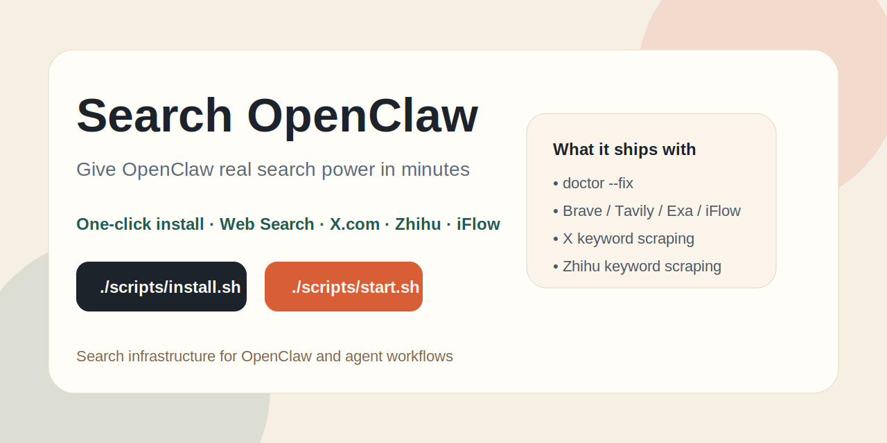

# Search OpenClaw

> Give OpenClaw real search power in minutes.  
> One-click install, provider setup, X.com scraping, Zhihu scraping, and an agent-friendly search CLI.




English · [中文](#中文版) · [Web Search](./docs/web-search.md) · [Search Routes](./docs/search-routes.md) · [FAQ](./docs/faq.md) · [Contributing](./CONTRIBUTING.md)

## English

Search OpenClaw is a practical search layer for OpenClaw:

- one-click install
- one-command startup
- provider configuration for Brave, Tavily, Exa, Perplexity, GitHub, and iFlow
- `doctor --fix` for skill installation and local auto-detection
- built-in X.com keyword scraping
- built-in Zhihu keyword scraping

### Real-World Verified Runs

- X.com keyword scraping: `220` results captured for `AI Agent`
- Zhihu keyword scraping: `220` stage-1 results captured for `AI Agent`
- Both numbers come from local runs on `2026-03-10`

This repo is not just documentation. The core search and scraping flows have been run locally and verified.

### One-Click Install

```bash
git clone https://github.com/hanchihuang/search-openclaw.git
cd search-openclaw
./scripts/install.sh
```

### One-Line Setup

```bash
git clone https://github.com/hanchihuang/search-openclaw.git && cd search-openclaw && BRAVE_API_KEY="<YOUR_KEY>" SMOKE_TEST=1 ./scripts/install.sh
```

### Start In One Command

```bash
./scripts/start.sh doctor
./scripts/start.sh search "latest AI agent news"
./scripts/start.sh scrape-social "AI Agent" --platform both
```

### Why This Exists

Most OpenClaw users do not lose to the model.  
They lose to a weak search stack:

- no reliable web search
- no provider fallback
- poor handling of time-sensitive information
- no clean way to scrape X or Zhihu

Search OpenClaw turns that into a usable workflow.

### What Makes It Different

- Reuses your local OpenClaw iFlow key automatically
- Supports both traditional search APIs and research-style iFlow flows
- Ships with X and Zhihu scraping instead of leaving “social search” as a TODO
- Designed for agents, not just humans reading webpages

### Quick Demo

```bash
./scripts/start.sh doctor --fix
./scripts/start.sh configure brave_api_key <YOUR_KEY>
./scripts/start.sh search "OpenClaw search setup"
./scripts/start.sh search "OpenClaw search setup" --provider iflow --structured
./scripts/start.sh login-x
./scripts/start.sh scrape-social "AI Agent" --platform x
```

---

## 中文版

## 这是什么

`Search OpenClaw` 是一个给 `OpenClaw` 补“搜索层”的项目。

它不想做一个新的 AI 应用壳子，而是把真正影响 Agent 落地效果的几件事做实：

- 一键安装
- 一键启动
- 一键检查搜索配置
- 一键抓取 `X.com` / `知乎` 关键词结果
- 一键复用本机 `OpenClaw` 的 `iFlow` 配置

如果你已经感受到：

- OpenClaw 很强，但“不会搜”
- 搜出来的结果不稳、不全、时效差
- 单一搜索源一挂就没法用
- 想抓 `X.com` / `知乎`，结果又要重新配一堆东西

那这个仓库就是为这件事准备的。

## 真实实测数据

- `X.com` 关键词抓取：`AI Agent` 实测拿到 `220` 条结果
- `知乎` 关键词抓取：`AI Agent` 第一阶段实测拿到 `220` 条结果
- 以上数据都来自本机 `2026-03-10` 的真实运行，不是示意数字

也就是说，这个仓库现在不是“只写了说明文档”，而是核心链路已经实际跑通过。

## 为什么这个项目更容易传播

因为它解决的问题足够具体，而且打开就能用。

很多项目的问题不是“做不到”，而是：

- 安装步骤太多
- 文档太散
- 只有框架，没有闭环
- 只讲原理，不给直接跑的入口

Search OpenClaw 这次直接把入口压缩成两步。

## 一键安装

```bash
git clone https://github.com/hanchihuang/search-openclaw.git
cd search-openclaw
./scripts/install.sh
```

## 一行完成安装

如果你已经有 `Brave API Key`，可以直接一行跑完安装、配置和冒烟测试：

```bash
git clone https://github.com/hanchihuang/search-openclaw.git && cd search-openclaw && BRAVE_API_KEY="<YOUR_KEY>" SMOKE_TEST=1 ./scripts/install.sh
```

如果你还想把知乎 Cookie 一起写进去，也可以：

```bash
git clone https://github.com/hanchihuang/search-openclaw.git && cd search-openclaw && BRAVE_API_KEY="<YOUR_KEY>" ZHIHU_COOKIE="<YOUR_COOKIE>" SMOKE_TEST=1 ./scripts/install.sh
```

这个脚本会自动完成：

- 创建 `.venv`
- 安装项目本体
- 安装 `Playwright Chromium`
- 安装 `Search OpenClaw skill`
- 执行 `doctor --fix`

## 一键启动

安装完成后，不需要自己找 Python 路径，直接：

```bash
./scripts/start.sh doctor
./scripts/start.sh search "OpenClaw 搜索配置建议"
./scripts/start.sh scrape-social "AI Agent" --platform both
```

如果你只想复制已经验证过的命令，优先用这两条：

```bash
./scripts/start.sh scrape-social "AI Agent" --platform x --max-items 200 --max-scrolls 80
./scripts/start.sh scrape-social "AI Agent" --platform zhihu --max-items 220 --max-scrolls 160 --no-new-stop 24 --page-delay-ms 1300 --stage1-only
```

## 现在能做什么

### 1. 给 OpenClaw 配真正能用的搜索

支持：

- `Brave`
- `Tavily`
- `Exa`
- `Perplexity`
- `GitHub`
- `iFlow`

并且内置：

- `doctor`
- `doctor --fix`
- `show-config`
- `search`

### 2. 直接抓 X.com

```bash
./scripts/start.sh login-x
./scripts/start.sh scrape-social "AI Agent" --platform x
```

现在这条链路已经不是“包装外部仓库”了，而是内置实现。  
实测已经能稳定抓到数百条结果。

### 3. 直接抓知乎

```bash
./scripts/start.sh configure zhihu_cookie "<YOUR_COOKIE>"
./scripts/start.sh scrape-social "AI Agent" --platform zhihu
```

知乎这边现在走的是：

- 搜索页 DOM
- 页面内嵌状态
- 网络响应 JSON

三路合并去重，而不是只抓首页可见内容。

### 4. 让 Agent 直接用

安装后会把 skill 写到这些位置：

- `~/.openclaw/skills/search-openclaw`
- `~/.claude/skills/search-openclaw`
- `~/.agents/skills/search-openclaw`

也就是说，不只是 OpenClaw，其他能跑命令行的 Agent 也能接进来。

## 最值得先试的命令

```bash
./scripts/start.sh doctor --fix
./scripts/start.sh configure brave_api_key <YOUR_KEY>
./scripts/start.sh search "latest AI agent news"
./scripts/start.sh search "OpenClaw 搜索配置建议" --provider iflow --stream
./scripts/start.sh scrape-social "AI Agent" --platform both
```

## 为什么值得 Star

这类项目真正稀缺的不是“技术炫技”，而是：

- 把一个高频痛点做成闭环
- 让普通人第一次就能跑通
- 让 Agent 用户少踩十倍的坑

如果你也在折腾：

- OpenClaw
- Claude Code
- Agent 搜索基建
- X / 知乎 / 网页抓取
- 多搜索源回退

这个仓库会比“又一个 AI wrapper”更实用。

## 仓库结构

```text
search_openclaw/
  cli.py                 # 命令行入口
  doctor.py              # 搜索层体检
  search.py              # 搜索 provider 调用
  social/
    x_keyword_search.py  # X.com 关键词抓取
    zhihu_keyword_search.py
    login_x.py
scripts/
  install.sh             # 一键安装
  start.sh               # 一键启动
docs/
  web-search.md
  search-routes.md
  faq.md
```

## 适合谁

- 想把 OpenClaw 变成“真的会搜”的用户
- 想给 Agent 配低成本搜索层的人
- 想做 X / 知乎情报收集的人
- 想做 Agent 基建、不是再做一层壳子的人

## 文档入口

- [Web Search](./docs/web-search.md)
- [Search Routes](./docs/search-routes.md)
- [FAQ](./docs/faq.md)
- [Contributing](./CONTRIBUTING.md)
- [公众号文章 HTML 成稿](./docs/wechat-launch-article.html)
- [GitHub About / Topics 文案](./docs/github-about.md)
- [社交封面图](./docs/assets/social-card.svg)

## License

MIT
